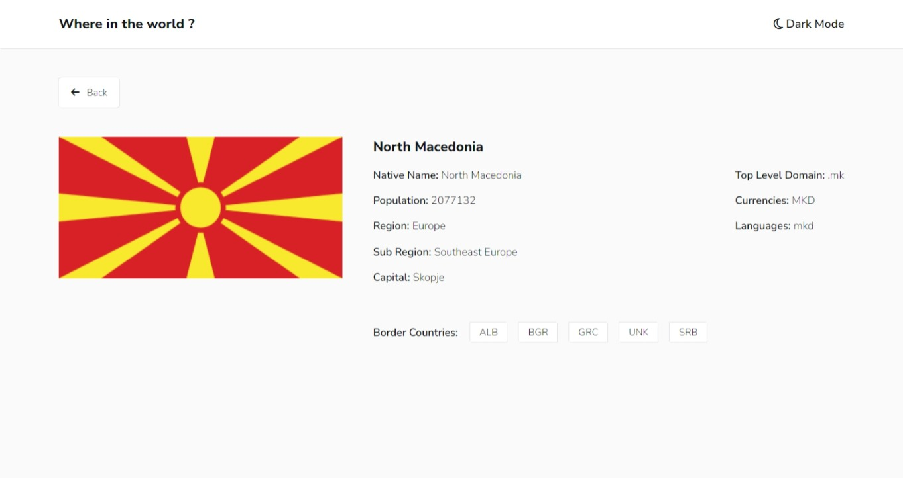

# Where in the world

Fetch Data From Countries' API and Display It In Beautiful and Responsive Design.

## Table of contents

- [Overview](#overview)
  - [Where in the world features](#Where-in-the-world-features)
  - [Screenshot](#screenshot)
  - [Links](#links)
- [My process](#my-process)
  - [Built with](#built-with)
  - [What I learned](#what-i-learned)
- [Author](#author)

## Overview

### Where in the world features

Users should be able to:

- See all countries from the API on the homepage.
- Search for a country using an input field.
- Filter countries by region.
- Click on a country to see more detailed information on a separate page.
- Click through to the border countries on the detail page.
- View the optimal layout for the interface depending on their device's screen size.
- See hover and focus states for all interactive elements on the page.
- Toggle the color scheme between light and dark mode.

### Screenshot



### Links

- Live Site URL : [Where in the world](https://mahmoudsmohammed.github.io/Where-in-the-world/)

## My process

### Built with

- HTML 5
- CSS 3
- SASS
- Bootstrap 5
- TypeScript
- JavaScript
- Font Awesome

### What I learned

- How structure the project files.
- Using Git and Github.
- Use Bootstrap Classes and Built-in Components Efficiently.
- Use TypeScript Which Makes it Easy To Debug The Code.
- Use SASS which makes Nesting and Variables More Organized. 
- Fetch Data From API, Extract Data from API, and Use API Data in The App.
- How to Manipulate the DOM.
- Asynchronous Operations, HTTP Requests and Promises. 

```Js
// Get Country Data
async function getCountryByFullName(inp: string) {
  let response =
    await fetch(`https://restcountries.com/v3.1/name/${inp}?fullText=true
  `);
  let selectedCountries = await response.json();
  return selectedCountries;
}
```

## Author

- Linkedin - [Mahmoud Sayed](https://www.linkedin.com/in/mahmoud-sayed-b85536217/)
- Codewars - [@MahmoudsMohammed](https://www.codewars.com/users/MahmoudsMohammed)
